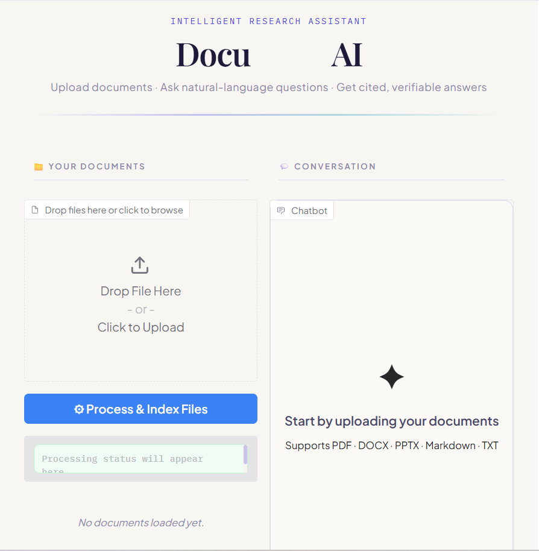
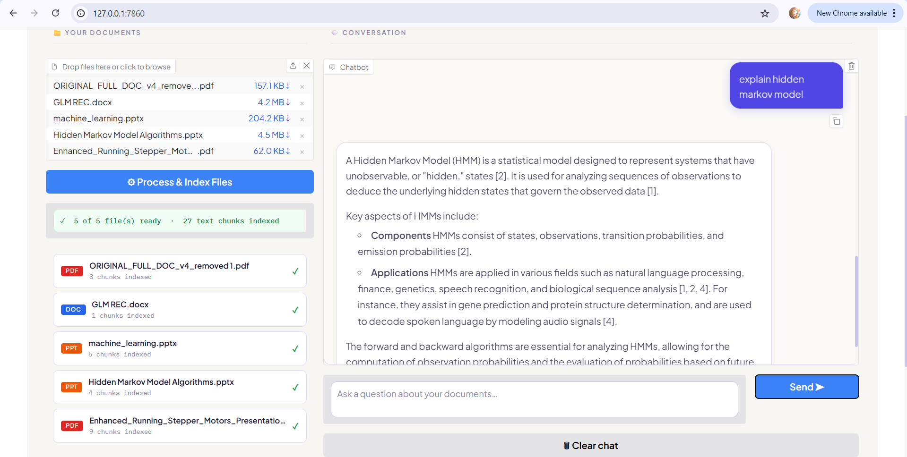
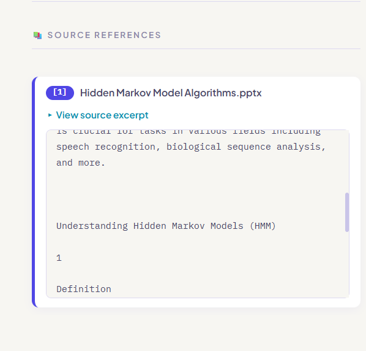

<div align="center">

# 📄 DocuMind AI
### Intelligent Document Research Assistant

*Ask questions. Get cited answers. Know exactly where every fact came from.*

[](https://python.org)
[](https://langchain.com)
[](https://ai.google.dev)
[](https://gradio.app)
[](https://faiss.ai)
 

</div>

---
## 🎥 Screenshots

### 1. Home Interface
Upload documents and start conversations with your private knowledge base.



### 2. Document Upload & Question Answering
Process files, ask questions, and receive cited answers.



### 3. Source References & Explainability
Inspect exact document passages used to generate responses.




---

## 🎯 Problem Statement

Knowledge workers, researchers, and analysts routinely work with large collections of documents — research reports, policy papers, project briefs, financial filings, and slide decks — spread across multiple file formats. Finding a specific fact means manually scanning through dozens of pages, with no reliable way to trace *which document* or *which page* an answer came from.

**This project addresses that problem directly:**

> *How can we enable professionals to query their own document collections in natural language, receive accurate and contextual answers, and immediately verify the exact source and passage behind every claim — without relying on general-purpose web search alone?*

DocuMind AI solves this through a **Retrieval-Augmented Generation (RAG)** pipeline that grounds every response in the user's uploaded documents, surfaces explicit citations with expandable source excerpts, and falls back to a live web search only when the documents genuinely lack an answer — clearly labelling which mode was used.

---

## ✨ Features

| Feature | Description |
|---|---|
| 📁 **Multi-format Upload** | Upload PDF, DOCX, PPTX, Markdown, and TXT files simultaneously |
| 🔍 **Semantic Search** | FAISS vector index with sentence-transformer embeddings for accurate retrieval |
| 🤖 **LLM-powered Answers** | Google Gemini 2.5 Flash generates clear, structured responses |
| 📚 **Inline Citations** | Every factual claim is tagged `[1]`, `[2]` matching expandable source cards |
| 🗂 **Source Excerpt Viewer** | Click any citation to reveal the exact passage from your document |
| 🌐 **Web Fallback** | If the answer is not in your docs, DuckDuckGo supplements with a clear `⚠️ Not in docs` warning |
| 💬 **Persistent Chat History** | Scrollable multi-turn conversation within a session |
| 🧩 **Chunk-level Transparency** | Each indexed document shows chunk count; status indicators confirm successful ingestion |

---
 
## 🏗 Architecture
<div align="center">
<pre>
  
┌─────────────────────────────────────────────────────────┐
│                     User (Gradio UI)                    │
└────────────────────┬────────────────────────────────────┘
                        Upload files / Ask question
                     ▼
┌─────────────────────────────────────────────────────────┐
│                  Document Ingestion Layer               │
│  PyPDF · Docx2txt · python-pptx · TextLoader            │
│         RecursiveCharacterTextSplitter (1000/200)       │
└────────────────────┬────────────────────────────────────┘
                        Text chunks + metadata
                     ▼
┌─────────────────────────────────────────────────────────┐
│               Embedding + Vector Store                  │
│    sentence-transformers/all-MiniLM-L6-v2  →  FAISS     │
└────────────────────┬────────────────────────────────────┘
                        Top-k=4 semantic retrieval
                     ▼
┌─────────────────────────────────────────────────────────┐
│                  RAG Chain (LangChain)                  │
│      RetrievalQA · stuff chain · custom prompt          │
│         Google Gemini 2.5 Flash (LLM)                   │
└──────────┬─────────────────────┬───────────────────────┘
             Answer found          <<<WEB_NEEDED>>> token
           ▼                     ▼
    Cited response          DuckDuckGo Search
    + source docs           + ⚠️ "Not in docs" label
           │                     │
           └──────────┬──────────┘
                      ▼
              Chat UI + Citations Panel
  
</pre>
</div>

---
 
## 🛠 Technology Stack

| Layer | Technology | Purpose |
|---|---|---|
| **UI** | Gradio 4.x | Web interface with custom CSS |
| **LLM** | Google Gemini 2.5 Flash | Answer generation |
| **Embeddings** | `all-MiniLM-L6-v2` (HuggingFace) | Semantic vector encoding |
| **Vector DB** | FAISS (CPU) | Fast similarity search |
| **Orchestration** | LangChain | RAG pipeline & chain management |
| **Doc Parsing** | PyPDF, Docx2txt, python-pptx | Multi-format ingestion |
| **Web Fallback** | DuckDuckGo Search (via LangChain) | Out-of-context queries |

---

## 🚀 Getting Started

### Prerequisites

- Python 3.9 or higher
-  A Google Gemini API key (free tier available through Google AI Studio)

### Installation

```bash
# 1. Clone the repository
git clone https://github.com/1pranesh/documind-ai.git
cd documind-ai

# 2. Create and activate a virtual environment
python -m venv venv
source venv/bin/activate        # Windows: venv\Scripts\activate

# 3. Install dependencies
pip install -r requirements.txt

# 4. Set your API key
export GOOGLE_API_KEY="your_gemini_api_key_here"
# Windows: set GOOGLE_API_KEY=your_gemini_api_key_here
```

### Running the App

```bash
python app.py
```

Open your browser at `http://127.0.0.1:7860`

---

## 📖 How to Use

1. **Upload** — Click "Drop files here" and select one or more PDF / DOCX / PPTX / Markdown / TXT files.
2. **Process** — Click **⚙ Process & Index Files**. The status bar confirms how many chunks were indexed.
3. **Ask** — Type your question in the chat box and press Enter or click **Send ➤**.
4. **Inspect sources** — The left panel updates with citation cards `[1]`, `[2]` … Click **"View source excerpt"** to see the exact text passage the answer was derived from.
5. **Web answers** — If the documents don't contain an answer, the system clearly labels the response *"Not in your uploaded documents"* and supplements with a web result.
6. **Export** — Click **⬇ Export chat (.md)** to download the full conversation as Markdown.

---

## 📂 Project Structure

```
documind-ai/
├── app.py               # Main application (UI + RAG pipeline)
├── requirements.txt     # Python dependencies
├── README.md            # This file
└── assets/              # screenshots 
```

---

## 💡 Key Design Decisions

**Why RAG over fine-tuning?**
Fine-tuning is expensive, slow, and must be redone for every new document set. RAG retrieves at query time, so any new document is available immediately after upload — no retraining required.

**Why FAISS over a cloud vector DB?**
For a local or self-hosted research tool, FAISS provides fast, dependency-free similarity search without requiring API keys or network calls. The tradeoff is in-memory only (no persistence across restarts); this is intentional for a privacy-first design where users' documents never leave their machine.

**Why sentence-transformers/all-MiniLM-L6-v2?**
It offers the best balance of embedding quality and inference speed for a CPU-only environment. The 384-dimension output keeps FAISS index sizes small while achieving strong semantic matching.

**Why DuckDuckGo for web fallback?**
No API key required, no rate-limit costs, and it preserves user privacy by not tying queries to a personal account.

---

## 🔮 Future Enhancements

- [ ] **Persistent vector store** — Save/load FAISS index to disk between sessions
- [ ] **Multi-session management** — Named workspaces for different document collections
- [ ] **OCR support** — Scanned PDF ingestion via Tesseract / Unstructured
- [ ] **Re-ranking** — Cross-encoder re-ranker for higher citation precision
- [ ] **Streaming responses** — Token-by-token streaming for faster perceived responses
- [ ] **Summarisation mode** — Auto-generate document summaries on upload
- [ ] **Chart & table extraction** — Parse tabular data from PDFs for quantitative Q&A
- [ ] **Deployment** — Dockerise and deploy to Hugging Face Spaces or AWS

---

## 📊 Use Cases for Data Analysts

| Scenario | Benefit |
|---|---|
| Reviewing multiple research reports | Instantly surface relevant statistics with page-level citations |
| Onboarding to a new project | Query all handover documents in plain English |
| Compliance & audit work | Trace every claim back to its source document |
| Competitive analysis | Upload competitor reports and ask cross-document questions |
| Academic literature review | Ask across multiple papers without reading each one fully |

---

 
## 👤 Author

**PRANESH P**  
*Data Analytics Graduate • Building AI & Data Analytics Projects*

🔗 [LinkedIn](https://www.linkedin.com/in/pranesh2b) •
💻 [GitHub](https://github.com/1pranesh) •
📧 [Email](mailto:ppranesh2b@gmail.com)

 


